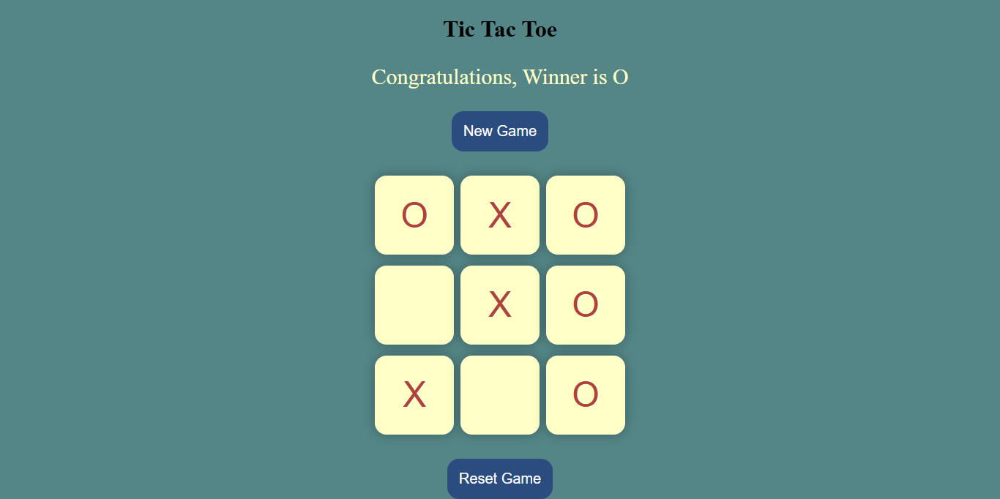

# ❌⭕ Interactive Tic Tac Toe Game

A minimalist, interactive web-based Tic-Tac-Toe game featuring custom button micro-interactions, turn tracking, and dynamic win-condition evaluation.

## 🚀 Live Demo
[👉 Click here to play Tic Tac Toe live!](https://priya-bhagat01.github.io/my_Tic-tac-toe_project/)

## 📸 Preview

## 🛠️ Core Features & Technical Highlights
- **Win Pattern Logic:** Implemented two-player turn tracking ('X' vs 'O') backed by an array algorithm evaluating 2D grid winning combinations on every click.
- **Tactile UI & Animations:** Engineered custom CSS hover effects and active "squishy" scale transitions to provide interactive physical feedback across grid tiles and control buttons.
- **Dynamic Game State:** Features instant winner declaration banners along with dedicated **New Game** and **Reset Game** handlers to reset local DOM matrices cleanly.

## 🧰 Tech Stack
- HTML5
- CSS3 (Transitions, Transforms & Flexbox)
- JavaScript (ES6 DOM Logic & Array Patterns)
